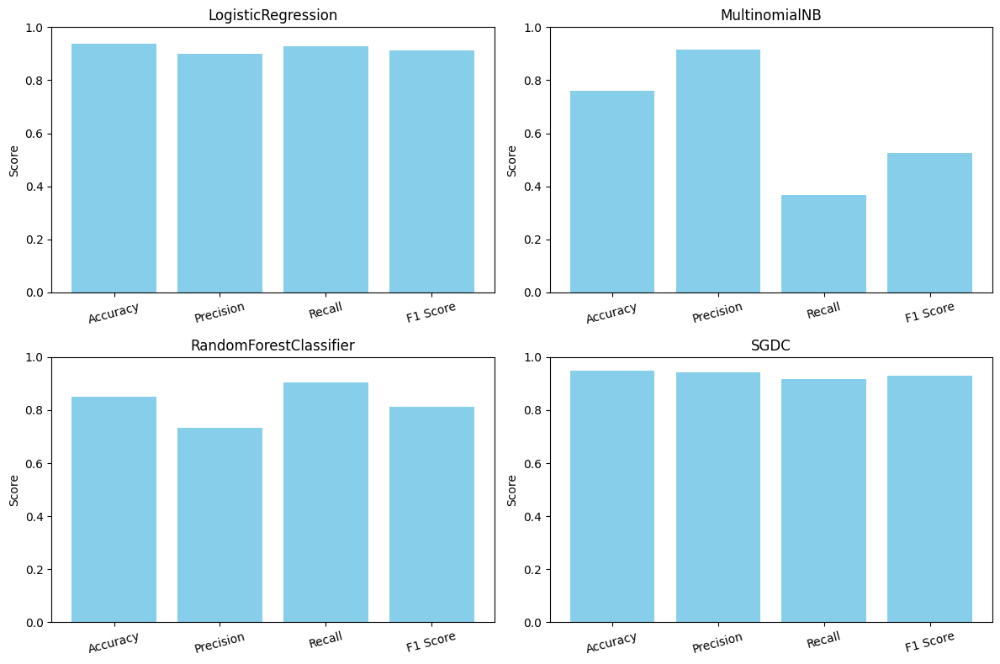

<div align="center">
  
  <h1>DEBUNKR</h1>
  <em>A Filipino fake news classifier built with Python, and SvelteKit — with by LIME for interpretability.</em>
</div>

## 🎯 Purpose

**DEBUNKR** addresses the urgent problem of fake news in the Philippines, especially in the lead-up to the May 2025 midterm elections. A Pulse Asia survey reports that 86% of Filipinos view fake news as a major issue, with 90% encountering political misinformation—primarily via social media and TV. Compounding the problem, 65% find it difficult to distinguish truth from falsehood, and 55% report frequent exposure to disinformation. The rise of AI-generated content (e.g., deepfakes) further complicates the landscape.

To combat this, we developed a Filipino fake news classifier to empower users with a tool that helps verify information and improve digital literacy. The backend leverages Python and multiple NLP libraries for model training, while the frontend is built using SvelteKit and TailwindCSS for optimized, scalable, and modular UI development.

---

## 🧠 Overview

**DEBUNKR** is a fake news detection web application focused on Filipino news content. It utilizes:

- Two datasets; one utilizing the [Tagalog language](https://huggingface.co/datasets/jcblaise/fake_news_filipino), and one in [English](https://github.com/aaroncarlfernandez/Philippine-Fake-News-Corpus) but is based in Filipino events.
- Ensemble learning with multiple ML algorithms
- A modern SvelteKit frontend
- [LIME (Local Interpretable Model-Agnostic Explanations)](https://github.com/marcotcr/lime) for transparency and model interpretability
- [Trafilatura](https://github.com/adbar/trafilatura) for web-scraping of suspicious news content

This is a final project for our **CCS 249 - Natural Language Processing** course.

---

## 📊 Model Results

The classifier used in the web application is an ensemble learning technique, utilizing for high performing ML algorithms. Specifically, we utilized _Logistic Regression_, _Multinomial NB_, _Random Forests Classifier_, _SGDC_.

These algorithms were evaluated using the following metrics: Accuracy, Precision, Recall, and F-1 Score.



Combined in the ensemble with soft voting hyperparameter **on**, it achieved a 93% accuracy. See `model_dev.ipynb` notebook for more details.

---

## 📊 Model Results

The classifier used in the web application is an ensemble learning technique, utilizing for high performing ML algorithms. Specifically, we utilized _Logistic Regression_, _Multinomial NB_, _Random Forests Classifier_, _SGDC_.

These algorithms were evaluated using the following metrics: Accuracy, Precision, Recall, and F-1 Score.


Combined in the ensemble with soft voting hyperparameter **on**, it achieved a 93% accuracy. See `model_dev.ipynb` notebook for more details.

---

## ⚙️ Setup Instructions

To set up the project locally, follow the instructions below:

```bash
# Clone the project
git clone https://github.com/hydraadra112/Debunkr.git

# --- Frontend Setup ---
cd Debunkr/frontend
npm install
npm run dev -- --open

# --- Backend Setup (Open a new terminal) ---
cd Debunkr/backend

# Create a virtual environment
python3 -m venv .venv

# Activate the environment
# On Linux/macOS:
source .venv/bin/activate
# On Windows:
# .venv\Scripts\activate

# Install dependencies
pip install -r requirements.txt

# Run the FastAPI server
uvicorn main:app --reload --port 8000
```

## References

```
@inproceedings{cruz2020localization,
  title={Localization of Fake News Detection via Multitask Transfer Learning},
  author={Cruz, Jan Christian Blaise and Tan, Julianne Agatha and Cheng, Charibeth},
  booktitle={Proceedings of The 12th Language Resources and Evaluation Conference},
  pages={2596--2604},
  year={2020}
}
```

```
@inproceedings{fernandez2019computing,
  title={Computing the linguistic-based cues of fake news in the Philippines towards its detection},
  author={Fernandez, Aaron Carl T and Devaraj, Madhavi},
  booktitle={Proceedings of the 9th International Conference on Web Intelligence, Mining and Semantics},
  pages={1--9},
  year={2019}
}
```

---

<div align="center">

## 👥 Creators

[John Manuel Carado](https://github.com/hydraadra112)  
[Cherilyn Marie Deocampo](https://github.com/chiichann)  
[Mark Andrei Encanto](https://github.com/Markndrei)  
[Chariz Dianne Falco](https://github.com/chariz1101)  
[Jephone Israel Jireh S. Torre](https://github.com/JephoneTorre)

</div>
